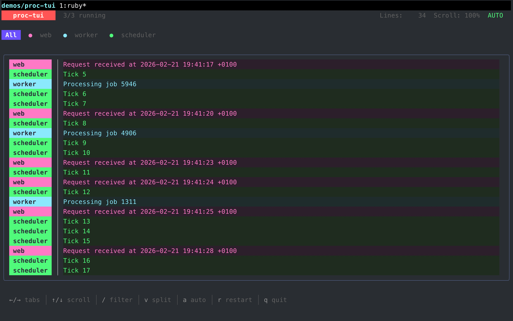

# Charm Ruby Demos

A collection of demo applications showcasing what you can build with the [Charm Ruby](https://github.com/marcoroth) libraries.

Ruby bindings for the [Charm](https://charm.land) ecosystem of terminal UI tools.

## Demos

### [`proc-tui`](./proc-tui)

An interactive terminal UI for running and monitoring Procfile processes, similar to [Overmind](https://github.com/DarthSim/overmind) or [Foreman](https://github.com/ddollar/foreman) but with a full TUI experience. Features tabbed log views, real-time search/filtering, split panes, process control (start/stop/restart), and auto-scrolling.



## Libraries

The Charm Ruby ecosystem includes:

| Library | Description |
|---------|-------------|
| [bubbletea-ruby](https://github.com/marcoroth/bubbletea-ruby) | TUI framework based on The Elm Architecture |
| [bubbles-ruby](https://github.com/marcoroth/bubbles-ruby) | TUI components for Bubble Tea apps |
| [lipgloss-ruby](https://github.com/marcoroth/lipgloss-ruby) | Style definitions for terminal layouts |
| [huh-ruby](https://github.com/marcoroth/huh-ruby) | Terminal forms and prompts |
| [glamour-ruby](https://github.com/marcoroth/glamour-ruby) | Stylesheet-based markdown rendering for the terminal |
| [gum-ruby](https://github.com/marcoroth/gum-ruby) | Ruby wrapper for Charm's Gum scripting tool |
| [harmonica-ruby](https://github.com/marcoroth/harmonica-ruby) | Physics-based spring animations |
| [ntcharts-ruby](https://github.com/marcoroth/ntcharts-ruby) | Terminal charts (sparklines, bar charts, line graphs) |
| [bubblezone-ruby](https://github.com/marcoroth/bubblezone-ruby) | Mouse zone tracking for Bubble Tea apps |
| [minitest-bubbletea](https://github.com/marcoroth/minitest-bubbletea) | TUI reporter for Minitest |

## Running a Demo

Each demo is self-contained in its own directory. To run one:

```bash
cd proc-tui
bundle install
./proc-tui Procfile.sample
```

## Contributing

Have an idea for a demo? Contributions are welcome! Each demo should live in its own directory with a `Gemfile` and a `README.md` explaining what it does and how to run it.

---

Part of [Charm Ruby](https://charm-ruby.dev).

<a href="https://charm-ruby.dev"></a>

[Lipgloss](https://github.com/marcoroth/lipgloss-ruby) • [Bubble Tea](https://github.com/marcoroth/bubbletea-ruby) • [Bubbles](https://github.com/marcoroth/bubbles-ruby) • [Glamour](https://github.com/marcoroth/glamour-ruby) • [Huh?](https://github.com/marcoroth/huh-ruby) • [Harmonica](https://github.com/marcoroth/harmonica-ruby) • [Bubblezone](https://github.com/marcoroth/bubblezone-ruby) • [Gum](https://github.com/marcoroth/gum-ruby) • [ntcharts](https://github.com/marcoroth/ntcharts-ruby)

The terminal doesn't have to be boring.
